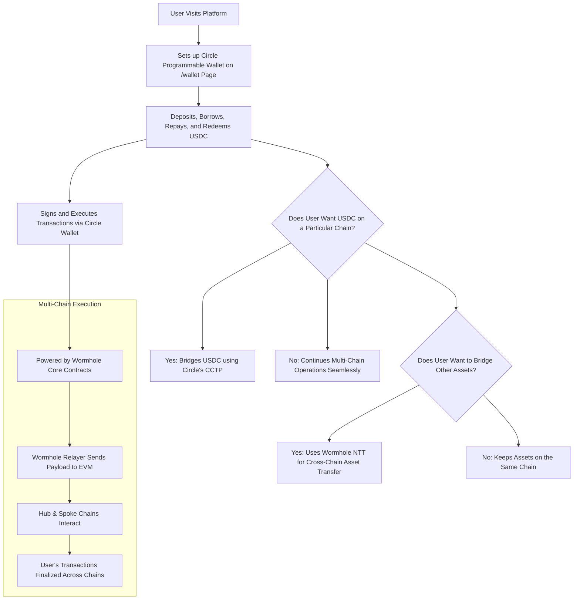
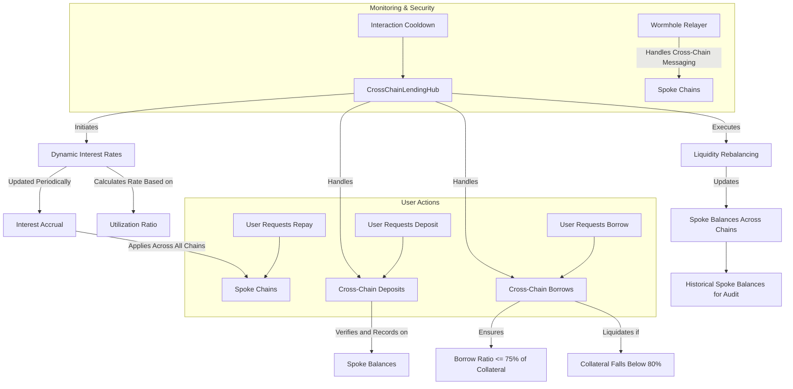

## CrossChain USDC Loans - Empowering Enterprises with Blockchain Innovation

## **Problem Statement:**

In many parts of the world, access to stable currencies like the U.S. Dollar is limited, particularly for individuals without a bank account or those in regions facing economic instability. Traditional financial systems often restrict access to international currencies, creating barriers to financial stability. This challenge highlights the need for global access to digital dollars, offering a secure and stable store of value, accessible to anyone regardless of their location or banking status.

## **Solution Statement:**

CrossChain USDCLoans offers a decentralized, blockchain-based solution to provide global access to digital dollars (USDC), allowing users to seamlessly hold, transact, and loan stable assets without the need for traditional banking infrastructure. By leveraging blockchain technology and Circle’s ecosystem, the platform enables cross-chain lending and borrowing of USDC, secured through Wormhole's interoperability, ensuring a scalable, secure, and efficient financial infrastructure for users worldwide.

## **Key Features:**

- **Cross-Chain Interoperability**: The project utilizes Wormhole to enable seamless cross-chain transactions, allowing users to access USDC across multiple blockchain networks without friction.
  
- **USDC Loans and Borrowing**: The platform enables users to take loans and borrow USDC through a decentralized, trustless system, ensuring global financial access to stable digital dollars.
  
- **Programmable Wallets**: Integrates Circle’s programmable wallets for secure and easy management of digital assets. This feature allows users to interact with USDC across multiple applications while maintaining full custody and security of their assets.
  
- **Secure Smart Contracts**: Built using Circle’s Smart Contract Platform, the project utilizes fully-audited smart contracts to facilitate loan issuance, repayment, and other financial transactions, providing transparency and security.
  
- **CCTP Integration**: Circle’s Cross-Chain Transfer Protocol (CCTP) enables the smooth movement of USDC across different blockchain ecosystems, ensuring liquidity and stability for users on any supported chain.
  
- **Global Accessibility**: Users from around the world can hold and transact in USDC without needing a traditional bank account, offering financial inclusion and stability.

## **Circle's Technology Stack in Use:**

### **USDC Utilization:**

USDC, as the core asset of the platform, provides a stable store of value and serves as the currency for all transactions, including lending, borrowing, and repayments. Its inherent stability as a fully-backed digital dollar ensures trust and reliability.

Code - https://github.com/kamalbuilds/CrossChainUSDCLoans/tree/master/frontend/app/api/wallet

### **Programmable Wallets:**

Circle's Programmable Wallets provide seamless integration with user interfaces, enabling smooth handling of USDC transactions and ensuring that users have full control of their assets across all chains.

Code - https://github.com/kamalbuilds/CrossChainUSDCLoans/tree/master/frontend/app/api/users

https://github.com/kamalbuilds/CrossChainUSDCLoans/blob/master/frontend/app/api/contract-executions/route.ts

```
const response = await axios.post(
      'https://api.circle.com/v1/w3s/user/transactions/contractExecution',
      {
        abiFunctionSignature,
        abiParameters,
        idempotencyKey: crypto.randomUUID(),
        contractAddress,
        feeLevel: 'HIGH',
        walletId: walletid
      },
      {
        headers: {
          'Authorization': `Bearer ${process.env.NEXT_PUBLIC_CIRCLE_API_KEY}`,
          'Content-Type': 'application/json',
          'X-User-Token': userToken
        }
      }
    )

    return NextResponse.json(response.data)
  } catch (error) {
    console.error('Error calling Circle API:', error)
    return NextResponse.json({ error: 'Error calling Circle API' }, { status: 500 })
  }
```
### **CCTP (Cross-Chain Transfer Protocol):**

By utilizing Circle’s CCTP, the project ensures efficient cross-chain transfers of USDC, offering low-cost, fast, and secure transfers, allowing users to interact with the decentralized loan system across multiple chains.

Code - https://github.com/kamalbuilds/CrossChainUSDCLoans/blob/master/frontend/app/cctp/page.tsx



### Explanation:
- **Users** come to the platform and set up their **Circle Programmable Wallet**.
- They use this wallet to sign and execute transactions (Deposit, Borrow, Repay, Redeem) across multiple chains.
- The **Wormhole Core Contracts** power the cross-chain operations, ensuring seamless execution, making users feel like they are working within one chain.
- If users want to keep their USDC on a specific chain, they can use **Circle’s CCTP** to bridge USDC between chains.
- For bridging other assets, **Wormhole's Native Token Transfers (NTT)** allows them to move assets across chains while retaining native token properties.

### **Wormhole's Core Contracts Utilisation:**

Wormhole’s **cross-chain interoperability** is central to the platform, enabling seamless communication between the hub and spoke chains. The project leverages **Wormhole Relayer** to transfer messages and assets between blockchains, allowing users to deposit, borrow, and repay USDC loans across multiple chains. This is facilitated through **secure payload delivery** via `sendPayloadToEvm`, which coordinates with Wormhole's **cross-chain messaging** capabilities. The use of **Wormhole Receiver** ensures proper message handling on each chain, enabling the transfer and management of user assets without liquidity fragmentation, preserving security and trust across the platform.

Code - https://github.com/kamalbuilds/CrossChainUSDCLoans/blob/master/smartcontract/contracts/CrossChainLendingSpoke.sol



### 1. **User Actions (Deposits, Borrows, Repayments)**:
   - The user initiates actions such as deposits, borrows, or repayments. These are handled by the **CrossChainLendingHub** contract.
   - For **Deposits**, the contract updates the user's balance on the **spoke chains** and records them in **spokeBalances**. 
   - For **Borrows**, the system checks if the user’s collateral is sufficient (not exceeding 75% borrow ratio). If the collateral is insufficient, the system may trigger **liquidation**.
   - For **Repayments**, the system updates both borrow and deposit balances.

### 2. **Dynamic Interest Rates**:
   - The interest rate is dynamically calculated by the hub based on the **utilization ratio** (the amount borrowed vs. the total deposits across all chains). 
   - This dynamic rate helps optimize the system’s performance by adjusting rates according to liquidity demands.
   - Interest is **accrued periodically** and applied across all **spoke chains**. These updates are recorded in historical balances for future audits.

### 3. **Liquidity Rebalancing**:
   - Liquidity is balanced across different spoke chains by the system to ensure there is enough collateral available on each chain to handle user actions.
   - This rebalancing ensures smooth functionality across multiple chains by **updating balances** on the spoke chains and maintaining **historical records** of the changes for transparency.

### 4. **Monitoring & Security**:
   - An **interaction cooldown** ensures users can’t spam actions too frequently, maintaining the system's integrity.
   - **Wormhole Relayer** handles all cross-chain messaging, enabling communication between the hub and spokes without the user feeling the complexity of different chains.

This flow ensures that user actions like deposits and borrows are handled in real-time, while dynamic interest rates and liquidity rebalancing keep the system efficient and balanced across chains.|

### Key Features Highlighted:
- **Dynamic Interest Rates**: Interest rates are dynamically calculated based on the utilization ratio (borrows vs. deposits) and applied across all chains.
- **Liquidity Rebalancing**: Balances are rebalanced across multiple spoke chains to ensure liquidity is properly distributed.
- **Cross-Chain Operations**: Users can deposit, borrow, and repay across different chains while Wormhole Relayer handles cross-chain messaging, ensuring seamless operations.
- **Collateral Management**: The system ensures that borrow ratios stay below 75% of collateral, and liquidation occurs when collateral falls below 80%.
- **Historical Tracking**: Spoke balances are tracked over time for auditing purposes.

### **Wormhole's Native Token Transfers (NTT):**

Wormhole’s NTT feature is integrated to provide secure cross-chain transfers of native tokens like USDC. NTT allows tokens to maintain their intrinsic properties across multiple chains, using mechanisms like burn-and-mint or lock-and-mint to ensure consistent token supply and prevent liquidity fragmentation. This flexibility enables seamless integration with multiple chains while maintaining full control over token contracts, ownership, and customization