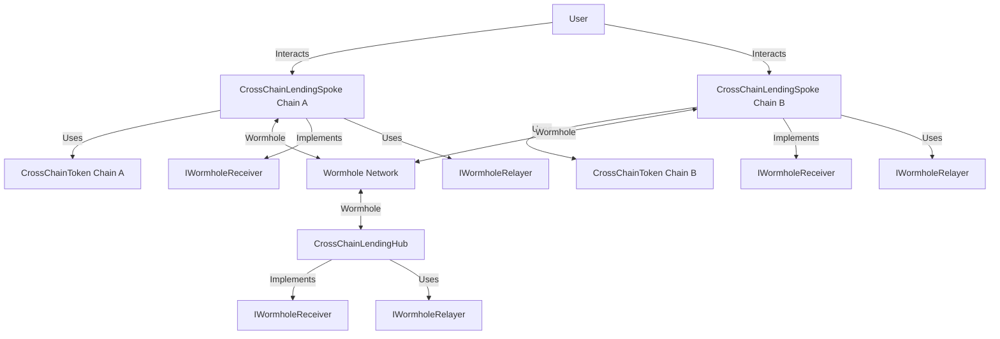

Documentation:

1. CrossChainLendingHub Contract:
   This contract serves as the central hub for the cross-chain lending platform. It manages deposits, borrows, and liquidity across multiple chains.

   Key features:
   - Manages deposits and borrows for users across different chains
   - Handles interest accrual and distribution
   - Coordinates with spoke contracts on different chains
   - Uses Wormhole for cross-chain communication

2. CrossChainLendingSpoke Contract:
   This contract operates on individual chains and interacts with users directly. It communicates with the hub contract through Wormhole.

   Key features:
   - Handles user deposits, withdrawals, and borrows on its specific chain
   - Implements liquidation mechanism
   - Uses Wormhole to send and receive messages from the hub

3. CrossChainToken Contract:
   This is an ERC20 token implementation used within the lending platform.

   Key features:
   - Implements standard ERC20 functionality
   - Includes minting and burning capabilities
   - Uses a multi-owner system for added security

4. IWormholeRelayer Interface:
   This interface defines the methods for interacting with Wormhole's relayer system, which facilitates cross-chain communication.

   Key features:
   - Defines methods for sending payloads across chains
   - Provides functions for quoting cross-chain transaction costs
   - Handles delivery of messages between chains

5. IWormholeReceiver Interface:
   This interface must be implemented by contracts that want to receive messages through Wormhole.

   Key features:
   - Defines the `receiveWormholeMessages` function that contracts must implement to receive cross-chain messages

How the system works with Wormhole:

1. When a user interacts with a spoke contract (e.g., depositing or borrowing), the spoke contract may need to communicate with the hub.

2. The spoke contract uses the IWormholeRelayer interface to send a message to the hub contract on another chain.

3. The hub contract, which implements IWormholeReceiver, receives and processes the message from the spoke.

4. The hub may then need to send a response or update other spokes. It uses IWormholeRelayer to send messages to the relevant spoke contracts.

5. Spoke contracts, also implementing IWormholeReceiver, receive and process messages from the hub.

6. This cycle of communication allows for coordinated lending operations across multiple chains.

Mermaid Diagram:

This diagram illustrates how users interact with spoke contracts on different chains, how these contracts use the CrossChainToken, and how they communicate with the central hub through the Wormhole network. It also shows the implementation of IWormholeReceiver and the use of IWormholeRelayer for cross-chain communication.